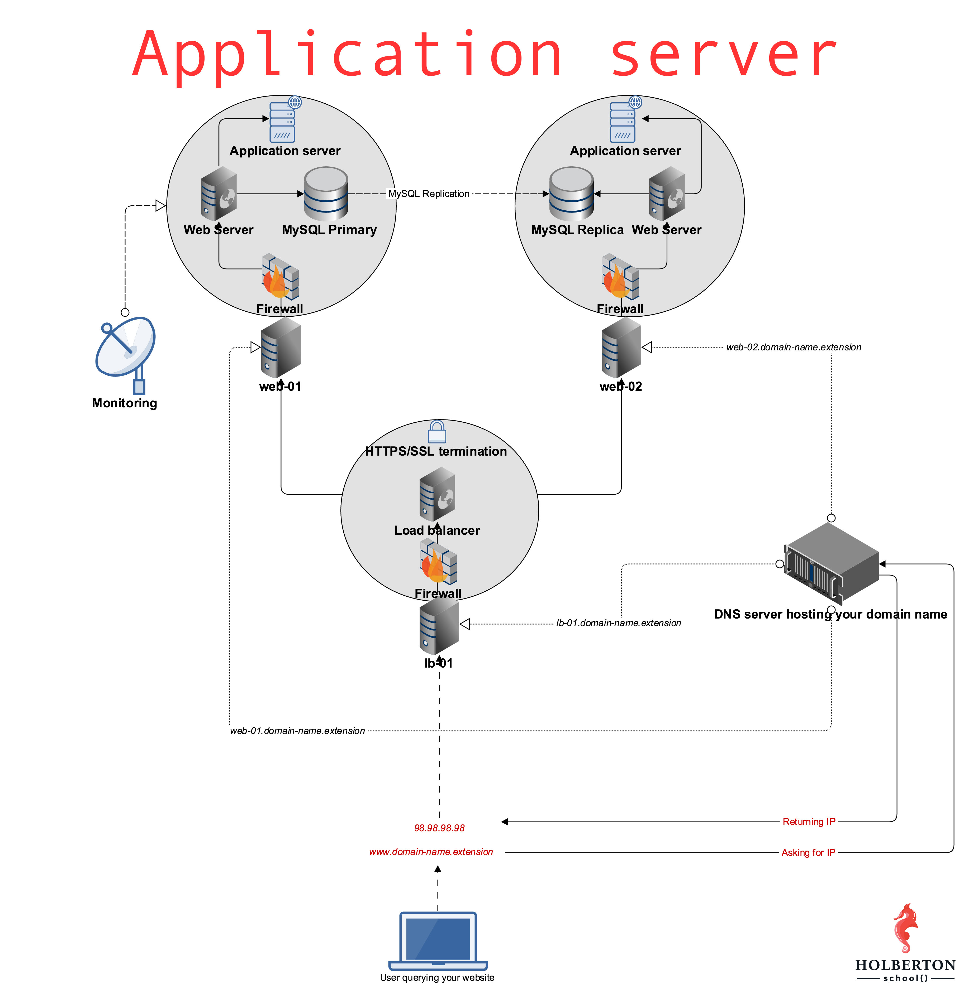
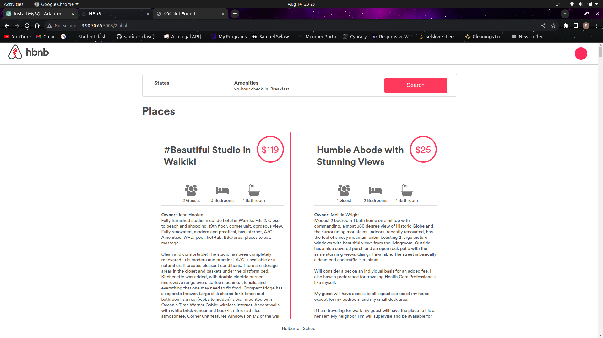
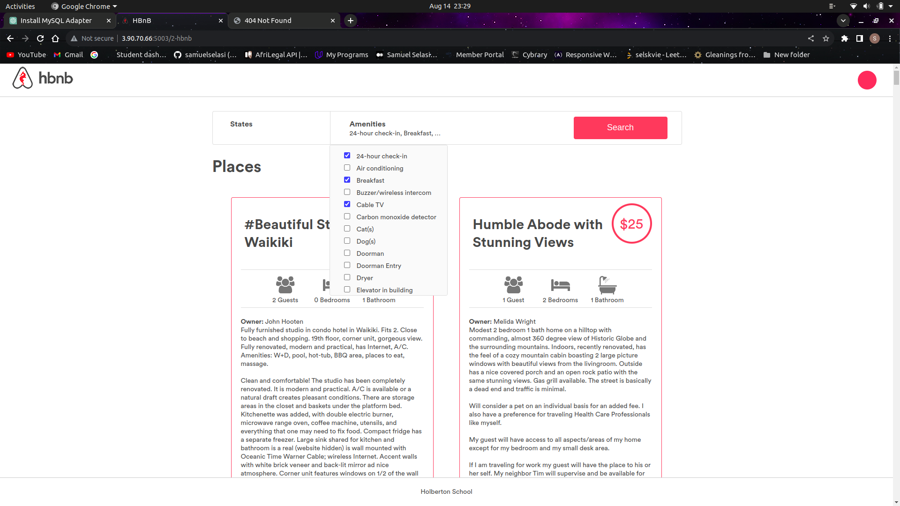

# 0x1A. Application server
##### `DevOps` `SysAdmin`



### Background Context
Your web infrastructure is already serving web pages via `Nginx` that you installed in your [first web stack project](../0x0C-web_server). While a web server can also serve dynamic content, this task is usually given to an application server. In this project you will add this piece to your infrastructure, plug it to your `Nginx` and make is serve your Airbnb clone project.

## Resources
**Read or watch**:

* [Application server vs web server](https://www.nginx.com/resources/glossary/application-server-vs-web-server/)
* [How to Serve a Flask Application with Gunicorn and Nginx on Ubuntu 16.04](https://www.digitalocean.com/community/tutorials/how-to-serve-flask-applications-with-gunicorn-and-nginx-on-ubuntu-16-04) (As mentioned in the video, do **not** install Gunicorn using `virtualenv`, just install everything globally)
* [Running Gunicorn](https://docs.gunicorn.org/en/latest/run.html)
* [Be careful with the way Flask manages slash](https://werkzeug.palletsprojects.com/en/0.14.x/routing/) in [route](https://flask.palletsprojects.com/en/1.0.x/api/#flask.Flask.route) - `strict_slashes`
* [Upstart documentation](https://doc.ubuntu-fr.org/upstart)

## Requirements
### General
* A `README.md` file, at the root of the folder of the project, is mandatory
* Everything Python-related must be done using `python3`
* All `config` files must have comments

## Bash Scripts
* All your files will be interpreted on Ubuntu `16.04` LTS
* All your files should end with a new line
* All your Bash script files must be executable
* Your Bash script must pass `Shellcheck` (version `0.3.7-5~ubuntu16.04.1` via `apt-get`) without any error
* The first line of all your Bash scripts should be exactly `#!/usr/bin/env bash`
* The second line of all your Bash scripts should be a comment explaining what is the script doing

## Tasks

[0. Set up development with Python](./README.md)

Let’s serve what you built for [AirBnB clone v2 - Web framework](https://github.com/samuelselasi/AirBnB_clone_v2) on `web-01`. This task is an exercise in setting up your development environment, which is used for testing and debugging your code before deploying it to production.

**Requirements**:

* Make sure that [task #3](0x0B-ssh/README.md) of your [SSH project](../0x0B-ssh) is completed for `web-01`. The checker will connect to your servers.
* Install the `net-tools` package on your server: `sudo apt install -y net-tools`
* Git clone your `AirBnB_clone_v2` on your `web-01` server.
* Configure the file `web_flask/0-hello_route.py` to serve its content from the route `/airbnb-onepage/` on port `5000`.
* Your Flask application object must be named `app` (This will allow us to run and check your code).
**Example**:

##### Window 1:
```
ubuntu@229-web-01:~/AirBnB_clone_v2$ python3 -m web_flask.0-hello_route
 * Serving Flask app "0-hello_route" (lazy loading)
 * Environment: production
   WARNING: Do not use the development server in a production environment.
   Use a production WSGI server instead.
 * Debug mode: off
 * Running on http://0.0.0.0:5000/ (Press CTRL+C to quit)
35.231.193.217 - - [02/May/2019 22:19:42] "GET /airbnb-onepage/ HTTP/1.1" 200 -
```
##### Window 2:
```
ubuntu@229-web-01:~/AirBnB_clone_v2$ curl 127.0.0.1:5000/airbnb-onepage/
Hello HBNB!ubuntu@229-web-01:~/AirBnB_clone_v2$
```

[1. Set up production with Gunicorn](./README.md)

Now that you have your development environment set up, let’s get your production application server set up with `Gunicorn` on `web-01`, port `5000`. You’ll need to install `Gunicorn` and any libraries required by your application. Your `Flask` application object will serve as a WSGI entry point into your application. This will be your production environment. As you can see we want the production and development of your application to use the same port, so the conditions for serving your dynamic content are the same in both environments.

**Requirements**:

* Install `Gunicorn` and any other libraries required by your application.
* The Flask application object should be called `app`. (This will allow us to run and check your code)
* You will serve the same content from the same route as in the previous task. You can verify that it’s working by binding a `Gunicorn` instance to localhost listening on port `5000` with your application object as the entry point.
* In order to check your code, the checker will bind a `Gunicorn` instance to port `6000`, so make sure nothing is listening on that port.

**Example**:
##### Terminal 1:

```
ubuntu@229-web-01:~/AirBnB_clone_v2$ gunicorn --bind 0.0.0.0:5000 web_flask.0-hello_route:app
[2019-05-03 20:47:20 +0000] [3595] [INFO] Starting gunicorn 19.9.0
[2019-05-03 20:47:20 +0000] [3595] [INFO] Listening at: http://0.0.0.0:5000 (3595)
[2019-05-03 20:47:20 +0000] [3595] [INFO] Using worker: sync
[2019-05-03 20:47:20 +0000] [3598] [INFO] Booting worker with pid: 3598
```
##### Terminal 2:

```
ubuntu@229-web-01:~$ curl 127.0.0.1:5000/airbnb-onepage/
Hello HBNB!ubuntu@229-web-01:~$
```

[2. Serve a page with Nginx](./2-app_server-nginx_config)

Building on your work in the previous tasks, configure `Nginx` to serve your page from the route `/airbnb-onepage/`

**Requirements**:

* `Nginx` must serve this page both locally and on its public IP on port `80`.
* `Nginx` should proxy requests to the process listening on port `5000`.
* Include your `Nginx` config file as `2-app_server-nginx_config`.

**Notes**:

* In order to test this you’ll have to spin up either your production or development application server (listening on port `5000`)
* In an actual production environment the application server will be configured to start upon startup in a system initialization script. This will be covered in the advanced tasks.
* You will probably need to `reboot` your server (by using the command `$ sudo reboot`) to have Nginx publicly accessible

**Example**:

### On my server:
#### Window 1:
```
ubuntu@229-web-01:~/AirBnB_clone_v2$ gunicorn --bind 0.0.0.0:5000 web_flask.0-hello_route:app
[2019-05-06 20:43:57 +0000] [14026] [INFO] Starting gunicorn 19.9.0
[2019-05-06 20:43:57 +0000] [14026] [INFO] Listening at: http://0.0.0.0:5000 (14026)
[2019-05-06 20:43:57 +0000] [14026] [INFO] Using worker: sync
[2019-05-06 20:43:57 +0000] [14029] [INFO] Booting worker with pid: 14029
```
### Window 2:
```
ubuntu@229-web-01:~/AirBnB_clone_v2$ curl 127.0.0.1/airbnb-onepage/
Hello HBNB!ubuntu@229-web-01:~/AirBnB_clone_v2$
```
### On my local terminal:
```
vagrant@ubuntu-xenial:~$ curl -sI 35.231.193.217/airbnb-onepage/
HTTP/1.1 200 OK
Server: nginx/1.10.3 (Ubuntu)
Date: Mon, 06 May 2019 20:44:55 GMT
Content-Type: text/html; charset=utf-8
Content-Length: 11
Connection: keep-alive
X-Served-By: 229-web-01

vagrant@ubuntu-xenial:~$ curl 35.231.193.217/airbnb-onepage/
Hello HBNB!vagrant@ubuntu-xenial:~$
```

[3. Add a route with query parameters](./3-app_server-nginx_config)

Building on what you did in the previous tasks, let’s expand our web application by adding another service for `Gunicorn` to handle. In `AirBnB_clone_v2/web_flask/6-number_odd_or_even`, the route `/number_odd_or_even/<int:n>` should already be defined to render a page telling you whether an integer is odd or even. You’ll need to configure `Nginx` to proxy HTTP requests to the route `/airbnb-dynamic/number_odd_or_even/(any integer)` to a `Gunicorn` instance listening on port `5001`. The key to this exercise is getting `Nginx` configured to proxy requests to processes listening on two different ports. You are not expected to keep your application server processes running. If you want to know how to run multiple instances of `Gunicorn` without having multiple terminals open, see tips below.

**Requirements**:

* `Nginx` must serve this page both locally and on its public IP on port `80`.
* `Nginx` should proxy requests to the route `/airbnb-dynamic/number_odd_or_even/(any integer)` the process listening on port `5001`.
* Include your `Nginx` config file as `3-app_server-nginx_config`.

**Tips**:

* Check out these articles/docs for clues on how to configure `Nginx`: [Understanding Nginx Server and Location Block Selection Algorithms](https://www.digitalocean.com/community/tutorials/understanding-nginx-server-and-location-block-selection-algorithms#matching-location-blocks), [Understanding Nginx Location Blocks Rewrite Rules](http://blog.pixelastic.com/2013/09/27/understanding-nginx-location-blocks-rewrite-rules/), [Nginx Reverse Proxy](https://docs.nginx.com/nginx/admin-guide/web-server/reverse-proxy/#).
* In order to spin up a Gunicorn instance as a detached process you can use the terminal multiplexer utility `tmux`. Enter the command `tmux new-session -d 'gunicorn --bind 0.0.0.0:5001 web_flask.6-number_odd_or_even:app'` and if successful you should see no output to the screen. You can verify that the process has been created by running `pgrep gunicorn` to see its PID. Once you’re ready to end the process you can either run `tmux a` to reattach to the processes, or you can run `kill <PID>` to terminate the background process by ID.

**Example**:

### Terminal 1:
```
ubuntu@229-web-01:~/AirBnB_clone_v2$ tmux new-session -d 'gunicorn --bind 0.0.0.0:5000 web_flask.0-hello_route:app'
ubuntu@229-web-01:~/AirBnB_clone_v2$ pgrep gunicorn
1661
1665
ubuntu@229-web-01:~/AirBnB_clone_v2$ tmux new-session -d 'gunicorn --bind 0.0.0.0:5001 web_flask.6-number_odd_or_even:app'
ubuntu@229-web-01:~/AirBnB_clone_v2$ pgrep gunicorn
1661
1665
1684
1688

ubuntu@229-web-01:~/AirBnB_clone_v2$ curl 127.0.0.1:5000/airbnb-onepage/
Hello HBNB!ubuntu@229-web-01:~/AirBnB_clone_v2$

ubuntu@229-web-01:~/AirBnB_clone_v2$ curl 127.0.0.1:5001/number_odd_or_even/6
<!DOCTYPE html>
<HTML lang="en">
  <HEAD>
    <TITLE>HBNB</TITLE>
  </HEAD>
  <BODY><H1>Number: 6 is even</H1></BODY>
</HTML>ubuntu@229-web-01:~/AirBnB_clone_v2
ubuntu@229-web-01:~$ 
ubuntu@229-web-01:~/AirBnB_clone_v2$ curl 127.0.0.1/airbnb-dynamic/number_odd_or_even/5
<!DOCTYPE html>
<HTML lang="en">
  <HEAD>
    <TITLE>HBNB</TITLE>
  </HEAD>
  <BODY><H1>Number: 5 is odd</H1></BODY>
</HTML>ubuntu@229-web-01:~/AirBnB_clone_v2$
```
### Local machine:
```
vagrant@ubuntu-xenial:~$ curl 35.231.193.217/airbnb-dynamic/number_odd_or_even/6<!DOCTYPE html>
<HTML lang="en">
  <HEAD>
    <TITLE>HBNB</TITLE>
  </HEAD>
  <BODY><H1>Number: 6 is even</H1></BODY>
</HTML>vagrant@ubuntu-xenial:~$
```

[4. Let's do this for your API](./4-app_server-nginx_config)

Let’s serve what you built for [AirBnB clone v3 - RESTful API](https://github.com/samuelselasi/AirBnB_clone_v3) on `web-01`.

**Requirements**:

* Git clone your `AirBnB_clone_v3`
* Setup `Nginx` so that the route `/api/` points to a `Gunicorn` instance listening on port `5002`
* `Nginx` must serve this page both locally and on its public IP on port `80`
* To test your setup you should bind `Gunicorn` to `api/v1/app.py`
* It may be helpful to import your data (and environment variables) from [this project](https://github.com/samuelselasi/AirBnB_clone_v2)
* Upload your `Nginx` config file as `4-app_server-nginx_config`

**Example**:

#### Terminal 1:
```
ubuntu@229-web-01:~/AirBnB_clone_v3$ tmux new-session -d 'gunicorn --bind 0.0.0.0:5002 api.v1.app:app'
ubuntu@229-web-01:~/AirBnB_clone_v3$ curl 127.0.0.1:5002/api/v1/states
[{"__class__":"State","created_at":"2019-05-10T00:39:27.032802","id":"7512f664-4951-4231-8de9-b18d940cc912","name":"California","updated_at":"2019-05-10T00:39:27.032965"},{"__class__":"State","created_at":"2019-05-10T00:39:36.021219","id":"b25625c8-8a7a-4c1f-8afc-257bf9f76bc8","name":"Arizona","updated_at":"2019-05-10T00:39:36.021281"}]
ubuntu@229-web-01:~/AirBnB_clone_v3$
ubuntu@229-web-01:~/AirBnB_clone_v3$ curl 127.0.0.1/api/v1/states
[{"__class__":"State","created_at":"2019-05-10T00:39:27.032802","id":"7512f664-4951-4231-8de9-b18d940cc912","name":"California","updated_at":"2019-05-10T00:39:27.032965"},{"__class__":"State","created_at":"2019-05-10T00:39:36.021219","id":"b25625c8-8a7a-4c1f-8afc-257bf9f76bc8","name":"Arizona","updated_at":"2019-05-10T00:39:36.021281"}]
ubuntu@229-web-01:~/AirBnB_clone_v3$
```
#### Local Terminal
```
vagrant@ubuntu-xenial:~$ curl 35.231.193.217/api/v1/states
[{"__class__":"State","created_at":"2019-05-10T00:39:27.032802","id":"7512f664-4951-4231-8de9-b18d940cc912","name":"California","updated_at":"2019-05-10T00:39:27.032965"},{"__class__":"State","created_at":"2019-05-10T00:39:36.021219","id":"b25625c8-8a7a-4c1f-8afc-257bf9f76bc8","name":"Arizona","updated_at":"2019-05-10T00:39:36.021281"}]
vagrant@ubuntu-xenial:~$
```

[5. Serve your AirBnB clone](./5-app_server-nginx_config)

Let’s serve what you built for [AirBnB clone - Web dynamic]() on `web-01`.

**Requirements**:

* Git clone your `AirBnB_clone_v4`
* Your `Gunicorn` instance should serve content from `web_dynamic/2-hbnb.py` on port `5003`
* Setup `Nginx` so that the route `/` points to your `Gunicorn` instance
* Setup `Nginx` so that it properly serves the static assets found in `web_dynamic/static/` (this is essential for your page to render properly)
* For your website to be fully functional, you will need to reconfigure `web_dynamic/static/scripts/2-hbnb.js` to the correct IP
* `Nginx` must serve this page both locally and on its public IP and port `5003`
* Make sure to pull up your Developer Tools on your favorite browser to verify that you have no errors
* Upload your `Nginx` config as `5-app_server-nginx_config`

After loading, your website should look like this:






[6. Deploy it!](./gunicorn.service)

Once you’ve got your application server configured, you want to set it up to run by default when Linux is booted. This way when your server inevitably requires downtime (you have to shut it down or restart it for one reason or another), your `Gunicorn` process(es) will start up as part of the system initialization process, freeing you from having to manually restart them. For this we will use `systemd`. You can read more about `systemd` in the documentation posted at the top of this project but to put it succinctly, it is a system initialization daemon for the Linux OS (amongst other things). For this task you will write a `systemd` script which will start your application server for you. As mentioned in the video at the top of the project, you do not need to create a Unix socket to bind the process to.

**Requirements**:

* Write a `systemd` script which starts a `Gunicorn` process to serve the same content as the previous task (`web_dynamic/2-hbnb.py`)
* The `Gunicorn` process should spawn 3 worker processes
* The process should log errors in `/tmp/airbnb-error.log`
* The process should log access in `/tmp/airbnb-access.log`
* The process should be bound to port `5003`
* Your `systemd` script should be stored in the appropriate directory on `web-01`
* Make sure that you start the `systemd` service and leave it running
* Upload `gunicorn.service` to GitHub

```
bob@dylan:~$ curl -s 127.0.0.1:5003/2-hbnb | tail -5
    </div>
    <footer>
      <p>Holberton School</p>
    </footer>
  </body>
</html>
bob@dylan:~$ 
bob@dylan:~$ curl -s 12.13.14.15/ | tail -5
    </div>
    <footer>
      <p>Holberton School</p>
    </footer>
  </body>
</html>
bob@dylan:~$
```

[7. No service interruption](./4-reload_gunicorn_no_downtime)

One of the most important metrics for any Internet-based business is its uptime. It is the percentage of the time over a given period that the service/product is accessible to customers. Let’s pick the example of Amazon.com, for every minute of downtime (which is the opposite of uptime), [it costs the company $2M](https://storageservers.wordpress.com/2016/03/14/amazon-downtime-costs-2-million-loss-per-minute/). Yet, application servers often need to restart to update with the new version of the code or new configuration, when doing this operation, an application server cannot serve traffic, which meant downtime.

#### To avoid this; application servers are designed with a master/workers infrastructure. The master is in charge of:

* Receiving requests
* Managing workers (starting, stopping)
* Distributing requests to workers

Workers are the actual ones processing the query by generation dynamic content by processing the application code.

To update an application without downtime, the master will proceed with a progressive rollout of the update. It will gracefully shut down some workers ( meaning that it will tell workers to finish processing the request they are working on, but will not send them new requests, once the worker is done, it’s will be shutdown) and start new ones with the new application code or configuration, then move on to the other old workers until it has renewed the whole pool.

### Write a simple Bash script to reload Gunicorn in a graceful way.

**Example**:
```
sylvain@ubuntu$ ps auxf | grep gunicorn
vagrant   9376  2.2  3.6  58068 18320 pts/3    S+   19:25   0:00  |   \_ /home/vagrant/AirBnB_clone_v4/bin/python3 /home/vagrant/AirBnB_clone_v4/bin/gunicorn --bind 0.0.0.0:8001 --workers 4 web_flask.0-hello_route:app
vagrant   9379  2.6  4.6  82800 23116 pts/3    S+   19:25   0:00  |       \_ /home/vagrant/AirBnB_clone_v4/bin/python3 /home/vagrant/AirBnB_clone_v4/bin/gunicorn --bind 0.0.0.0:8001 --workers 4 web_flask.0-hello_route:app
vagrant   9380  2.6  4.6  82804 23120 pts/3    S+   19:25   0:00  |       \_ /home/vagrant/AirBnB_clone_v4/bin/python3 /home/vagrant/AirBnB_clone_v4/bin/gunicorn --bind 0.0.0.0:8001 --workers 4 web_flask.0-hello_route:app
vagrant   9381  2.4  4.6  82808 23128 pts/3    S+   19:25   0:00  |       \_ /home/vagrant/AirBnB_clone_v4/bin/python3 /home/vagrant/AirBnB_clone_v4/bin/gunicorn --bind 0.0.0.0:8001 --workers 4 web_flask.0-hello_route:app
vagrant   9383  2.4  4.6  82816 23136 pts/3    S+   19:25   0:00  |       \_ /home/vagrant/AirBnB_clone_v4/bin/python3 /home/vagrant/AirBnB_clone_v4/bin/gunicorn --bind 0.0.0.0:8001 --workers 4 web_flask.0-hello_route:app
vagrant   9388  0.0  0.1  10460   940 pts/2    S+   19:25   0:00      \_ grep --color=auto gunicorn
sylvain@ubuntu$ ./4-reload_gunicorn_no_downtime
sylvain@ubuntu$ ps auxf | grep gunicorn
vagrant   9376  1.0  3.6  58068 18368 pts/3    S+   19:25   0:00  |   \_ /home/vagrant/AirBnB_clone_v4/bin/python3 /home/vagrant/AirBnB_clone_v4/bin/gunicorn --bind 0.0.0.0:8001 --workers 4 web_flask.0-hello_route:app
vagrant   9393  6.5  4.6  82832 23168 pts/3    S+   19:25   0:00  |       \_ /home/vagrant/AirBnB_clone_v4/bin/python3 /home/vagrant/AirBnB_clone_v4/bin/gunicorn --bind 0.0.0.0:8001 --workers 4 web_flask.0-hello_route:app
vagrant   9394  6.5  4.6  82832 23172 pts/3    S+   19:25   0:00  |       \_ /home/vagrant/AirBnB_clone_v4/bin/python3 /home/vagrant/AirBnB_clone_v4/bin/gunicorn --bind 0.0.0.0:8001 --workers 4 web_flask.0-hello_route:app
vagrant   9395  6.0  4.6  82840 23180 pts/3    S+   19:25   0:00  |       \_ /home/vagrant/AirBnB_clone_v4/bin/python3 /home/vagrant/AirBnB_clone_v4/bin/gunicorn --bind 0.0.0.0:8001 --workers 4 web_flask.0-hello_route:app
vagrant   9396  7.0  4.6  82844 23188 pts/3    S+   19:25   0:00  |       \_ /home/vagrant/AirBnB_clone_v4/bin/python3 /home/vagrant/AirBnB_clone_v4/bin/gunicorn --bind 0.0.0.0:8001 --workers 4 web_flask.0-hello_route:app
vagrant   9402  0.0  0.1  10460   936 pts/2    S+   19:25   0:00      \_ grep --color=auto gunicorn
sylvain@ubuntu$
```
In this example, you can see that my Bash script tells the master Gunicorn renewed all the workers.

For testing it, please use the command `$ sudo reboot` to reboot your server (not `shutdown`!!)
